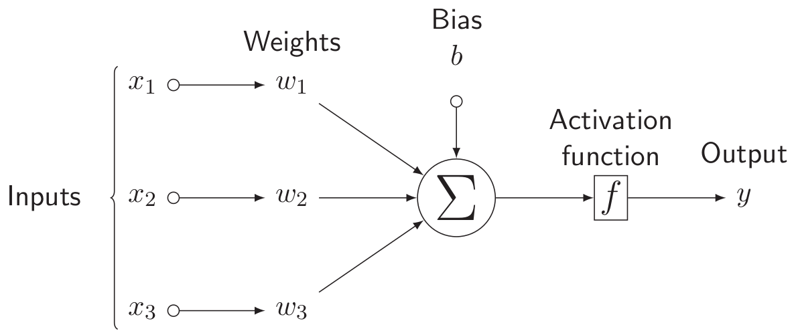
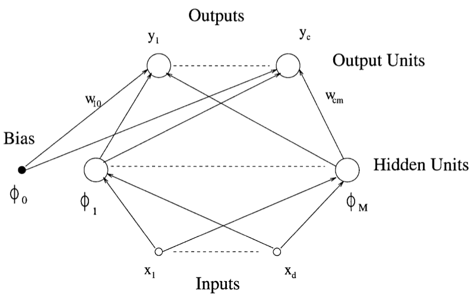
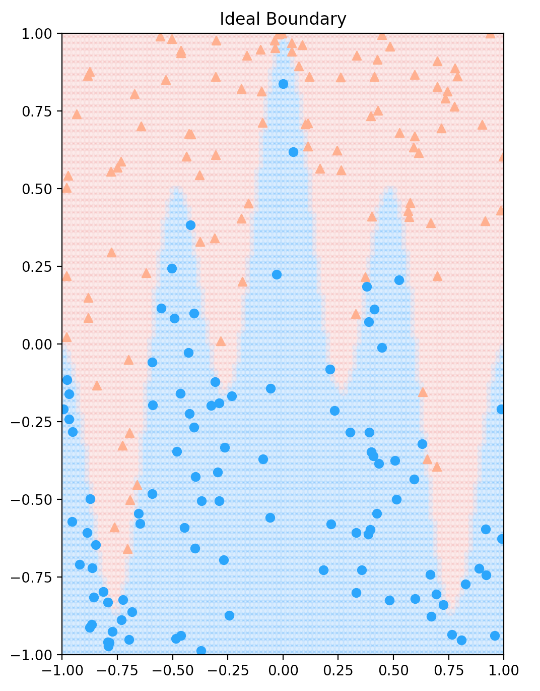
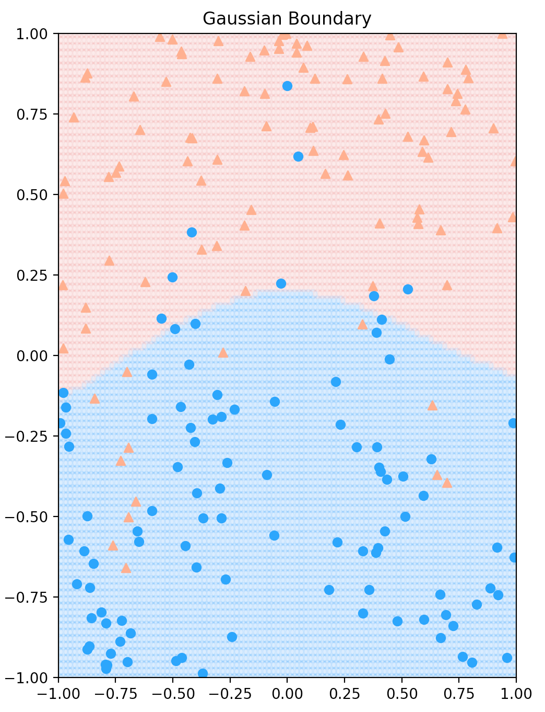

# PyTorch templates for most common Neural Networks

## Perceptron
- Implementation [here](./perceptron.py).

\
\
Fig. 1 - Perceptron model

## Multilayer Perceptron
- Implementation [here](./multilayer_perceptron.py)

\
\
Fig. 2 - Multilayer Perceptron (MLP) model

## Radial Basis Neural Networks

**Summary**
- Radial basis function layer ([here](./radial_basis_function_nn.py))
- Library of kernels ([here](./radial_basis_functions.py)) [3]
- Coefficients (centers and scaling factors) trained using Gradient Descent (Adam) and Binary Cross Entropy (*torch.nn.BCEWithLogitsLoss*) for loss computation, on a binary classificaiton task and Toy data.

A Radial Basis Function Network is an artificial neural network that uses radial basis functions as activation functions. The outup of the network is a linear combination of radial basis functions of the inputs and neuron parameters. Radial basis function networks have many uses, including funciton approximation, time series prediction, clssification, and system control [5].

Radial Basis Functions (RBF) networks typically have three layers: an input, a hidden layer with a non-linear RBF activation function and a linear aoutput layer, as depicted in Fig. 3.

\
Fig. 3 - RBF model

\
A Radial Basis Function (RBF), , is one whose output is symmetric around an associated center, . That is, , where ||.|| is a vector norm [4]. For example, selecting the Euclidean norm and letting , one sees that the Gaussian function is an RBF. Note that Gaussian functions are also characterized by a width or scle parameter, , and this is true for many other popular RBF classes as well. So such classes can be respresented as:
\
\

An example of a gaussian RBF is shown in Fig. 5 for a binary classification task using Toy data.\
\
\
Fig. 4 - Ground Truth for Toy data.

\
Fig. 5 - RBF using gaussian kernel fitted to Toy data.

## Cite this work
    J. Rico, (2021) Common Neural Network templates in PyTorch. 
    [Source code](https://github.com/jvirico/pytorch-templates)

## References
[1] - [PyTorch: Introduction to NN - feedforward/MLP](https://medium.com/biaslyai/pytorch-introduction-to-neural-network-feedforward-neural-network-model-e7231cff47cb)\
[2] - [Creating a Multilayer Perceptron with PyTorch and Lightning](https://www.machinecurve.com/index.php/2021/01/26/creating-a-multilayer-perceptron-with-pytorch-and-lightning/)
\
[3] - [JeremyLinux/PyTorch-Radial_Basis_Function-Layer](https://github.com/JeremyLinux/PyTorch-Radial-Basis-Function-Layer)
\
[4] - HOWLETT, Robert J.; JAIN, Lakhmi C. Radial basis function networks 2: new advances in design. Physica, 2013.
[5] - [Radial basis function network - Wikipedia](https://en.wikipedia.org/wiki/Radial_basis_function_network)

